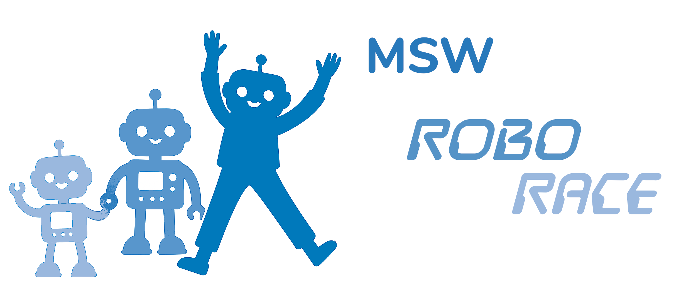
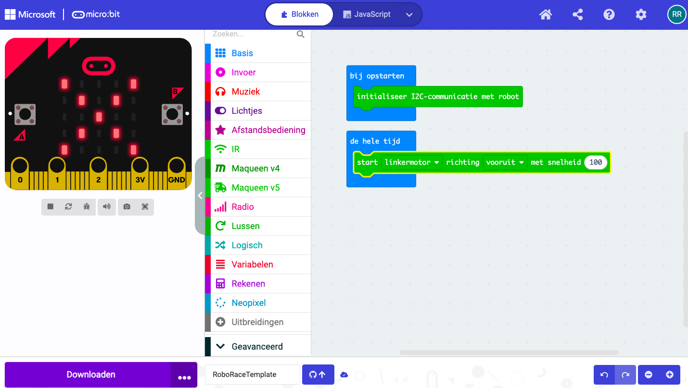
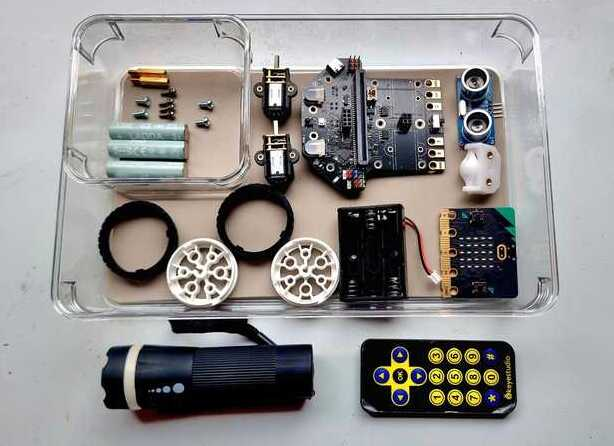
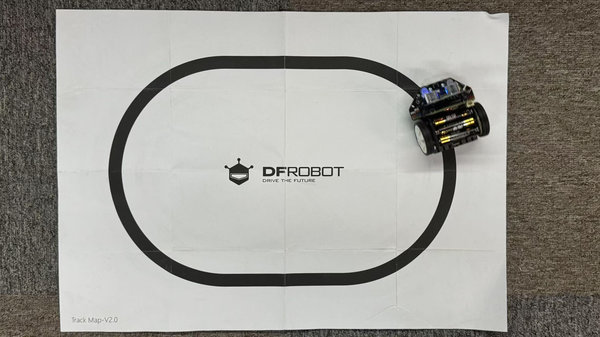

## 📂 Inhoud
1. [Introductie](#introductie)
2. [Programmeeromgeving](#programmeeromgeving)
3. [De Robot](#de-robot)
4. [Lesopbouw](#lesopbouw)
5. [Links](#links)

---

## Introductie
Dit jaar zijn we begonnen met het geven van roboticalessen aan groep 5.
In kleine groepjes van maximaal 8 leerlingen worden in een serie van 6 lessen de basisbeginselen uitgelegd van programmeren en robotica.
Hierbij wordt steeds gekeken naar de overeenkomsten en verschillen tussen mens en robot in hoe deze hun omgeving waarnemen en daarop kunnen reageren.

De nadruk bij de lessen ligt steeds op het **zelf doen**. Zelf je robot en de arena in elkaar zetten, zelf je programma's bedenken en naar de robot sturen. Uiteindelijk kan iedereen in de laatste les laten zien hoe goed hun robot een route kan vinden door een parcours vol hindernissen.

## Programmeeromgeving
We maken gebruik van de [micro:bit](https://microbit.org/nl/), een klein printplaatje dat door de BBC speciaal is ontwikkeld voor het onderwijs. Het heeft een ingebouwde LED-matrix, sensoren, bluetooth en programmeerbare knoppen die uitnodigen om spelenderwijs te ontdekken hoe leuk en verrassend programmeren kan zijn. De programmas worden gemaakt in de binnen de [MakeCode programmeer- en simulatieomgeving](https://makecode.microbit.org/) met de  [MakeCode Blocks](https://makecode.microbit.org/blocks) programmeertaal; een intuitieve en visuele manier van programmeren waarmee ieder kind direct aan de slag kan. Vanuit deze programmeeromgeving kan het gemaakte programma via een usb-kabel naar de microbit worden verzonden. Voor iedere leerling is er een eigen micro:bit, een robot en een Chromebook waarop de MakeCode omgeving draait. 

De Micro:bit is zeer populair in het onderwijs. In Nederland worden er momenteel meer dan 10.000 micro:bits gebruikt op meer dan 500 basisscholen. Wereldwijd zijn er inmiddels meer dan 10 miljoen micro:bits verkocht. Door deze popularteit is er een enorme hoeveelheid programmeervoorbeelden, projectideeën, instructiefilmpjes en documentatie beschikbaar.

## De Robot

                  
De robot die in de lessen wordt gebruikt is een [Maqueen Lite v5](https://www.dfrobot.com/product-2937.html) van [DFRobot](https://www.dfrobot.com/).
De robot zelf bevat een aantal sensoren (lichtsterkte, infrarood, lijnvolgsensoren en een afstandssensor), twee motoren en een hoop meer-kleuren LED's. Zodra de micro:bit in de connector op de robot wordt gestoken zijn al deze sensoren en actuatoren vanuit de micro:bit uit te lezen en te bedienen. Samen met de sensoren en actuatoren die de micro:bit zelf rijk is ontstaat er een toegankelijk en veelzijdig platform dat talloze manieren de interactie met zijn omgeving aan kan gaan. Voor deze robot is er een uitgebreide bibliotheek met functieblokken beschikbaar waarmee iedere functie van de robot eenvoudig in programma's gebruikt kan worden.

## Lesopbouw

 

* **Les 1.**  In deze les duiken we meteen in het diepe. Iedere leerling mag met behulp van een gedetaileerd stappenplan zelf een eigen robot opbouwen uit een bonte verzameling onderdelen. Hierdoor raakt iedereen meteen goed wegwijs met alle onderdelen van de robot en kan de belangrijkste hiervan ook aanwijzen en benoemen.
* **Les 2.** Na een klassikale uitleg over hoe de mens met zijn zintuigen de wereld waarneemt en met gebaar, stem en wellicht nog wel creatievere manieren de interactie met zijn omgeving kan aangaan, gaan we ontdekken welke 'zintuigen' (sensoren) de robot heeft en over welke actuatoren de robot beschikt om te reageren op prikkels uit zijn omgeving. Gezamenlijk stellen we een overzicht op van eigenschappen die bij mens en robot overeenkomen en eigenschappen die duidelijk verschillen. De robots zijn voor deze les geprogrammeerd met een kennismakingsprogramma. De leerlingen kunnen hiermee op ontdekkingsreis door te observeren hoe de robot reageert op uiteenlopende prikkels; van licht, infrarood, geluid, afstand en...
* **Les 3.** In deze les concentreren we ons op de micro:bit zelf. We halen de micro:bit uit de robot en en gebruiken de robot dus even niet. Het is de eerste kennismaking met de MakeCode programmeeromgeving en de basisbeginselen van het programmeren. Aan het einde van de les heeft iedereen zijn eerste programma's gemaakt en naar de micro:bit gestuurd. Iedereen is nu in staat om stilstaande en bewegende plaatjes te tonen op de LED-matrix, zijn eigen naam op de LED-matrix  te laten zien en om de microbit geluidjes te laten maken. 
* **Les 4.** In deze les behandelen we een aantal fundamentele programmablokken; doe iets ALS de linker knop wordt ingedrukt, doe iets anders ALS de rechterknop wordt ingedrukt; kijk welke van de twee waarnemingen groter is; wacht een periode; verhoog een teller iedere keer dat de linker knop wordt ingedrukt en verlaag de teller iedere keer de rechter knop wordt ingedrukt. (kortom: conditionele logica, vergelijkingen en boolse logica, variabelen en toekenningen). In het laatste deel van deze les stappen we weer terug naar de robot en brengen het geleerde in praktijk: we laten de robot bewegen in de richting van het ingedrukte pijltje op de afstandsbediening.
* **Les 5.** Nu gaan we wat complexere programma's maken: een lijn-volg programma, op tijd stoppen voor een obstakel, het bedenken van een strategie om om een obstakel heen navigeren en dit ook te programmeren.
* **Les 6.** De finale! In deze les gaat iedereen het robotprogramma uit de vorige les laten zien aan de anderen. Iedere robot mag proberen om zo goed mogelijk een hindernisparcours af te leggen. Aan het einde krijgt iedereen een medaille en een diploma.
 

# Links
Wil je meer te weten komen over de BBC micro:bit, de MakeCode programmeeromgeving en de Maqueen robot, bekijk dan de onderstaande links:
 

 
[Microbit.org](https://microbit.org/nl/) Alles over de micro:bit en de Micro:bit Educational Foundation  
[Codekinderen microbit projecten](https://codekinderen.nl/microbit-projecten-2/) Micro:bit projecten  
[Codekids](https://www.codekids.nl/category/micro-bit/) nog meer Micro:bit projecten en nieuws 
[Microbit101 quickstart](https://microbit101.nl/quickstart-microbit-kaarten/) tientallen Micro:bit projecten en ideeen 
[ICG leskisten](https://webshop.ictleskisten.nl/product-categorie/micro-bit/) Micro:bit info en onderdelen 
[Mr. Morrison](https://mrmorrison.co.uk/) Micro:bit starter lessons and beyond... een serie videos en meer over de Micro:bit (engels) 
[Maqueen v5 robot wiki](https://wiki.dfrobot.com/SKU_MBT0046_Maqueen_V5) Alle ins en outs van de Maqueen robot 
[Maqueen Robot bij arduitronics](https://www.arduitronics.com/product/6551/maqueen-lite-v5-microbit-robot-kit-for-stem-line-tracking-obstacle-avoidance-%E0%B9%81%E0%B8%97%E0%B9%89%E0%B8%88%E0%B8%B2%E0%B8%81-dfrobot) meer info over de Maqueen robot (engels) 

