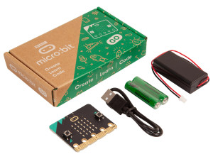
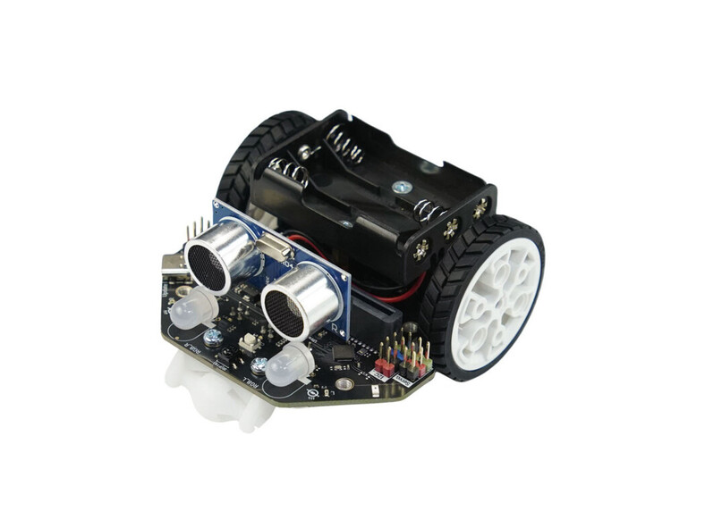

<!-- 
---
---
-->
## Cadeautips voor de feestdagen

Bij cursus robotica die dit jaar op school gestart is, gebruiken wij de [BBC micro:bit](https://microbit.org/nl/) een klein printplaatje dat door de BBC speciaal is ontwikkeld voor het onderwijs. Het heeft een ingebouwde LED-matrix, sensoren, bluetooth en programmeerbare knoppen die uitnodigen om spelenderwijs te ontdekken hoe leuk en verrassend programmeren kan zijn.

De micro:bit kan zelfstandig gebruikt worden om oneindig veel leuke programmeerprojectjes mee te maken. Je kan de micro:bit ook gebruiken als 'hersenen' van een Maqueen robot. Je kan de robot dan leren te reageren op zijn omgeving, een hindernisparcours te laten afleggen of er gewoon lekker mee racen.

Als er kinderen zijn (en ouders natuurlijk 😀) die thuis, na school en in de kerstvakantie verder willen gaan met wat ze hebben geleerd tijdens de roboticalessen of alvast thuis willen uitproberen wat ze binnenkort in de cursus gaan leren... dan zou je Sint of de Kerstman de onderstaande links  kunnen influisteren. De Micro:bit samen met de  Maqueen (v5) robot is precies dezelfde combinatie die ook in de lessen wordt gebruikt. 

 
[micro:bit GO bundel, €19,95 bij Kiwi Electronics](https://www.kiwi-electronics.com/nl/bbc-microbit-boards-kits-accessoires-276/bbc-microbit-v2-2-go-bundel-10260) 
[Of bij SOS Solutions: GO bundel, €19,90](https://www.sossolutions.nl/bbc-micro-bit-go-v2) 
 
  
[DFRobot Maqueen versie 5(!), €39,31 bij Kiwi Electronics](https://www.kiwi-electronics.com/nl/bbc-microbit-boards-kits-accessoires-276/maqueen-lite-v5-microbit-robot-kit-voor-stem-20499) 
 
Als Sint helemaal los wil gaan op robotica en wat dieper in de buidel wil tasten... dan kan de robot ook nog uitgebreid worden met deze mechanische onderdelenset: 
  
[Mecanical set: €50,46 bij RS-online](https://nl.rs-online.com/web/p/stem-robot-kits/2049904) 
[of €57,46 bij Kiwi Electronics](https://www.kiwi-electronics.com/nl/maqueen-mechanical-parts-set-7407) 

# Verdere info
Wil je meer te weten komen over de BBC micro:bit, de MakeCode programmeeromgeving en de Maqueen robot, bekijk dan de onderstaande links:
 
 
[Microbit.org](https://microbit.org/nl/) Alles over de micro:bit en de Micro:bit Educational Foundation  
[Codekinderen microbit projecten](https://codekinderen.nl/microbit-projecten-2/) Micro:bit projecten  
[Codekids](https://www.codekids.nl/category/micro-bit/) nog meer Micro:bit projecten en nieuws 
[Microbit101 quickstart](https://microbit101.nl/quickstart-microbit-kaarten/) tientallen Micro:bit projecten en ideeen 
[ICT leskisten](https://webshop.ictleskisten.nl/product-categorie/micro-bit/) Micro:bit info en onderdelen 
[Mr. Morrison](https://mrmorrison.co.uk/) Micro:bit starter lessons and beyond... een serie videos en meer over de Micro:bit (engels) 
[Maqueen v5 robot wiki](https://wiki.dfrobot.com/SKU_MBT0046_Maqueen_V5) Alle ins en outs van de Maqueen robot 
[Maqueen Robot bij arduitronics](https://www.arduitronics.com/product/6551/maqueen-lite-v5-microbit-robot-kit-for-stem-line-tracking-obstacle-avoidance-%E0%B9%81%E0%B8%97%E0%B9%89%E0%B8%88%E0%B8%B2%E0%B8%81-dfrobot) meer info over de Maqueen robot (engels) 
[Handleiding inelkaarzetten Robot](resources/Roborace_handleiding_inelkaarzetten_robot.pdf)
 
 
Zie ook: [Roborace MSW](https://roboracemsw.github.io/RoboRace/)
 

###### [N.B. De links op deze pagina zijn uitsluitend een vrijblijvende suggestie.  De school noch de docenten hebben enig commercieel belang bij deze tips en zij aanvaarden dan ook ook op geen enkele manier enige aansprakelijkheid]

