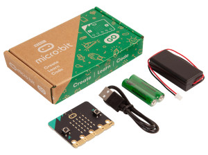

  

  

 

## Gift Ideas for the Holidays

In the robotics course that started at school this year, we use the [BBC micro:bit](https://microbit.org/nl/), a small circuit board specially developed by the BBC for education. It features a built-in LED matrix, sensors, Bluetooth, and programmable buttons that encourage learning through play and discovering how fun and surprising programming can be.

The micro:bit can be used on its own to create an endless variety of fun programming projects. You can also use the micro:bit as the “brain” of a Maqueen robot. This allows you to teach the robot to respond to its environment, complete an obstacle course, or simply race around with it.

If there are children (and parents, of course 😀) who would like to continue at home—after school and during the Christmas holidays—with what they’ve learned in the robotics lessons, or want to try out at home what they will soon learn in the course… then you might want to give Saint Nicholas or Santa Claus a hint using the links below. The micro:bit together with the Maqueen (v5) robot is exactly the same combination used in the lessons.

 
[micro:bit GO bundel, €19,95 at Kiwi Electronics](https://www.kiwi-electronics.com/nl/bbc-microbit-boards-kits-accessoires-276/bbc-microbit-v2-2-go-bundel-10260) 
[Or at SOS Solutions: GO bundel, €17,95](https://www.sossolutions.nl/bbc-micro-bit-go-v2) 
 
  
[DFRobot Maqueen versie 5(!), €41,73 at Kiwi Electronics](https://www.kiwi-electronics.com/nl/bbc-microbit-boards-kits-accessoires-276/maqueen-lite-v5-microbit-robot-kit-voor-stem-20499) 
 
**Note:** The micro:bit can be used independently **without** a robot... but the robot **cannot** function without the micro:bit!
 

# Further Information
If you would like to learn more about the BBC micro:bit, the MakeCode programming environment, and the Maqueen robot, please check out the links below:
 
 
[Microbit.org](https://microbit.org/nl/) Everything about the micro:bit and the Micro:bit Educational Foundation  
[Codekinderen microbit projecten](https://codekinderen.nl/microbit-projecten-2/) Micro:bit projects  
[Codekids](https://www.codekids.nl/category/micro-bit/) even more Micro:bit projects and news 
[Microbit101 quickstart](https://microbit101.nl/quickstart-microbit-kaarten/) several Micro:bit projects and ideas 
[ICT leskisten](https://webshop.ictleskisten.nl/product-categorie/micro-bit/) Micro:bit info and parts 
[Mr. Morrison](https://mrmorrison.co.uk/) Micro:bit starter lessons and beyond... videos about the Micro:bit (english) 
[Maqueen v5 robot wiki](https://wiki.dfrobot.com/SKU_MBT0046_Maqueen_V5) All ins en outs of the Maqueen robot 
[Maqueen Robot bij arduitronics](https://www.arduitronics.com/product/6551/maqueen-lite-v5-microbit-robot-kit-for-stem-line-tracking-obstacle-avoidance-%E0%B9%81%E0%B8%97%E0%B9%89%E0%B8%88%E0%B8%B2%E0%B8%81-dfrobot) more info about the Maqueen robot (english) 
[Assembly instructions for the Robot (dutch)](resources/Roborace_handleiding_inelkaarzetten_robot.pdf)
 
 

See also: [Roborace MSW](https://roboracemsw.github.io/RoboRace/)
 
###### [Note: The links on this page are provided purely as a non-binding suggestion. Neither the school nor the teachers have any commercial interest in these recommendations, and they accept no liability whatsoever.]

