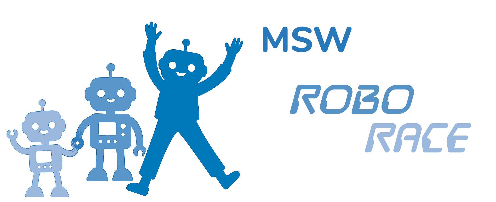
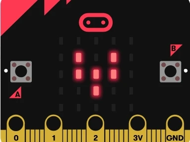
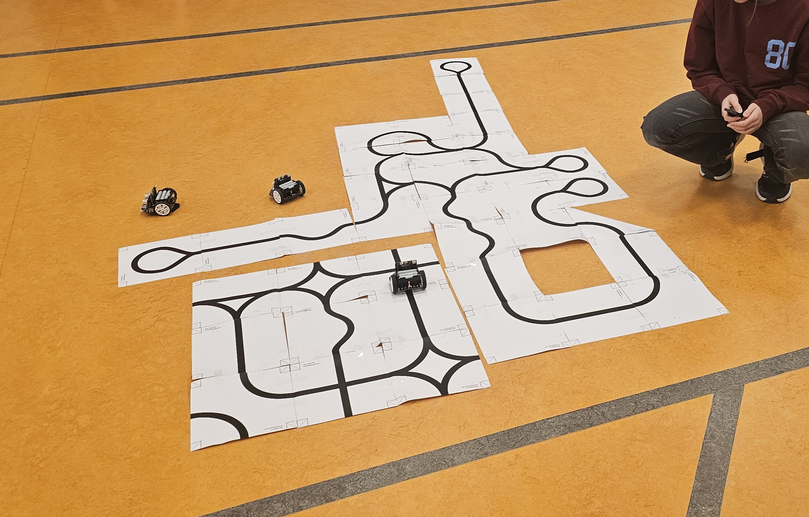
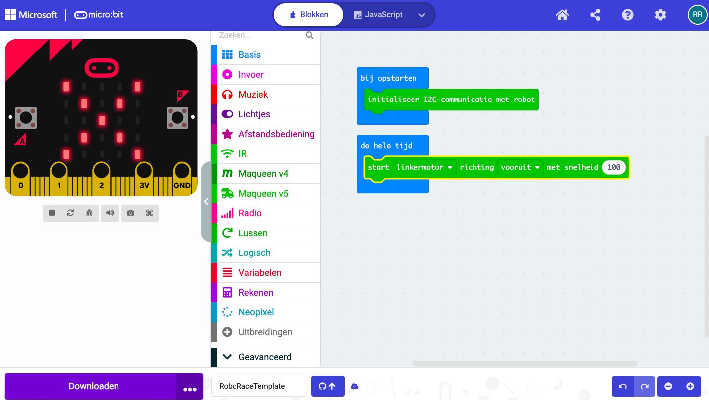
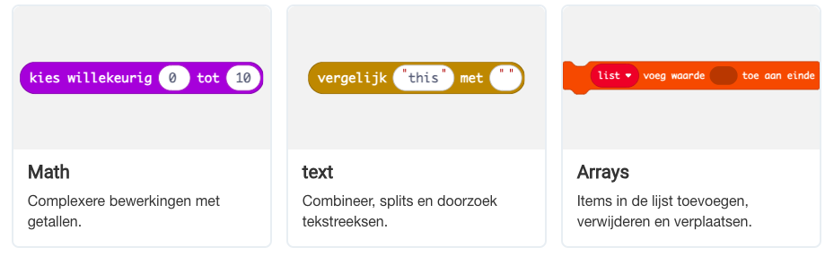
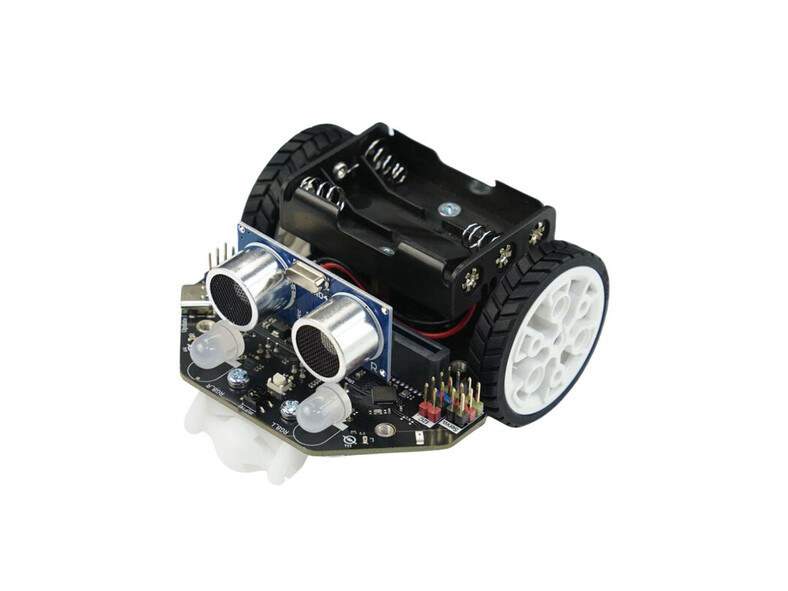
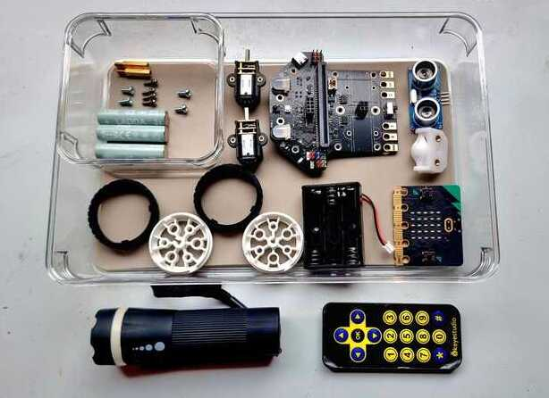
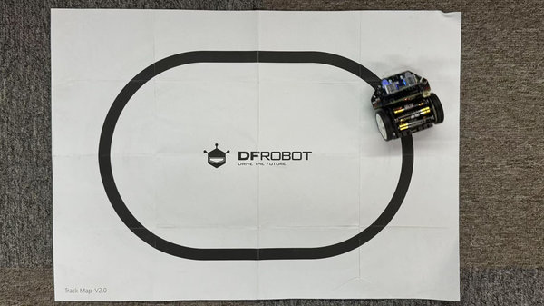

  

  

## 📂 Contents
1. [Introduction](#introduction)
2. [Programming Environment](#programming-environment)
3. [The Robot](#the-robot)
4. [Lesson Structure](#lesson-structure)
5. [Links](#links)

---

## Introduction
This year we started offering robotics lessons to Grade 5 students.  
In small groups of up to 8 students, the basic principles of programming and robotics are taught over a series of 6 lessons.  
Throughout the course, we continuously explore the similarities and differences between humans and robots, and how both perceive and respond to their environment.

The lessons strongly emphasize **learning by doing**. Students build their own robot and arena, create their own programs, and upload them to the robot. In the final lesson, everyone demonstrates how well their robot can navigate a self-designed obstacle course.

## Programming Environment
We use the [micro:bit](https://microbit.org/nl/), a small circuit board developed by the BBC specifically for education. It includes a built-in LED matrix, sensors, Bluetooth, and programmable buttons that encourage playful exploration and show how fun and surprising programming can be.  
 
Programs are created in the [MakeCode programming and simulation environment](https://makecode.microbit.org/) using the [MakeCode Blocks](https://makecode.microbit.org/blocks) programming language—an intuitive and visual way of coding that allows every child to get started right away. From this environment, programs can be transferred to the micro:bit via a USB cable. Each student has their own micro:bit, a robot, and a Chromebook running the MakeCode environment. 

The micro:bit is extremely popular in education. In the Netherlands, more than 10,000 micro:bits are currently used in over 500 primary schools. Worldwide, more than 10 million micro:bits have been sold. Due to this popularity, there is a vast amount of programming examples, project ideas, instructional videos, and documentation available. 
 

## The Robot

                  
The robot used in the lessons is a [Maqueen Lite v5](https://www.dfrobot.com/product-2937.html) by [DFRobot](https://www.dfrobot.com/).  
The robot includes several sensors (light intensity, infrared, line-following sensors, and a distance sensor), two motors, and multiple RGB LEDs. Once the micro:bit is inserted into the robot’s connector, all these sensors and actuators can be read and controlled from the micro:bit. 
 
Combined with the sensors and actuators already built into the micro:bit, this creates an accessible and versatile platform capable of interacting with its environment in countless ways. An extensive library of function blocks is available for this robot, making it easy to use all its features in programs.

## Lesson Structure

 

* **Lesson 1.** We dive straight in. Each student builds their own robot using a detailed step-by-step guide and a wide variety of components. This helps everyone quickly become familiar with all parts of the robot and identify the most important ones by the end of the lesson.  

* **Lesson 2.** After a class discussion about how humans perceive the world through their senses and interact using gestures, voice, and other creative means, we explore the robot’s “senses” (sensors) and actuators. Together, we create an overview of similarities and differences between humans and robots. The robots run an introductory program, allowing students to explore how they respond to stimuli such as light, infrared, sound, distance, and more.  

* **Lesson 3.** In this lesson, we focus on the micro:bit itself. We remove it from the robot and temporarily stop using the robot. This is the first introduction to the MakeCode environment and the basics of programming. By the end of the lesson, everyone has created and uploaded their first programs. Students can display static and animated images, show their name on the LED matrix, and make sounds with the micro:bit.  

* **Lesson 4.** We cover fundamental programming blocks: perform an action IF the left button is pressed, do something else IF the right button is pressed; compare values; wait for a period; increase a counter when the left button is pressed and decrease it when the right button is pressed. (In short: conditional logic, comparisons, Boolean logic, variables, and assignments.)  

* **Lesson 5.** We return to the robot and apply what we’ve learned. The robot moves in the direction indicated by a remote control. Then we build more advanced programs: line-following, stopping before an obstacle, designing strategies to navigate around obstacles, and testing and optimizing these solutions.  

* **Lesson 6.** The grand finale! Everyone presents their robot program to the group. Each robot attempts to complete an obstacle course as effectively as possible. At the end, everyone receives a medal and a certificate.  
 

# Links

If you would like to learn more about the BBC micro:bit, the MakeCode programming environment, and the Maqueen robot, check out the links below:
 

 

[Microbit.org](https://microbit.org/nl/) All about the micro:bit and the Micro:bit Educational Foundation  
[Codekinderen microbit projects](https://codekinderen.nl/microbit-projecten-2/) Micro:bit projects  
[Codekids](https://www.codekids.nl/category/micro-bit/) more Micro:bit projects and news 
[Microbit101 quickstart](https://microbit101.nl/quickstart-microbit-kaarten/) dozens of Micro:bit projects and ideas 
[ICG lesson kits](https://webshop.ictleskisten.nl/product-categorie/micro-bit/) Micro:bit info and components 
[Mr. Morrison](https://mrmorrison.co.uk/) Micro:bit starter lessons and beyond... a series of videos and more (English) 
[Maqueen v5 robot wiki](https://wiki.dfrobot.com/SKU_MBT0046_Maqueen_V5) Everything about the Maqueen robot 
[Maqueen Robot at Arduitronics](https://www.arduitronics.com/product/6551/maqueen-lite-v5-microbit-robot-kit-for-stem-line-tracking-obstacle-avoidance-%E0%B9%81%E0%B8%97%E0%B9%89%E0%B8%88%E0%B8%B2%E0%B8%81-dfrobot) more information about the Maqueen robot (English) 
[Gift ideas](https://roboracemsw.github.io/RoboRace/cadeautips_en.html) If you want to purchase your own set 
